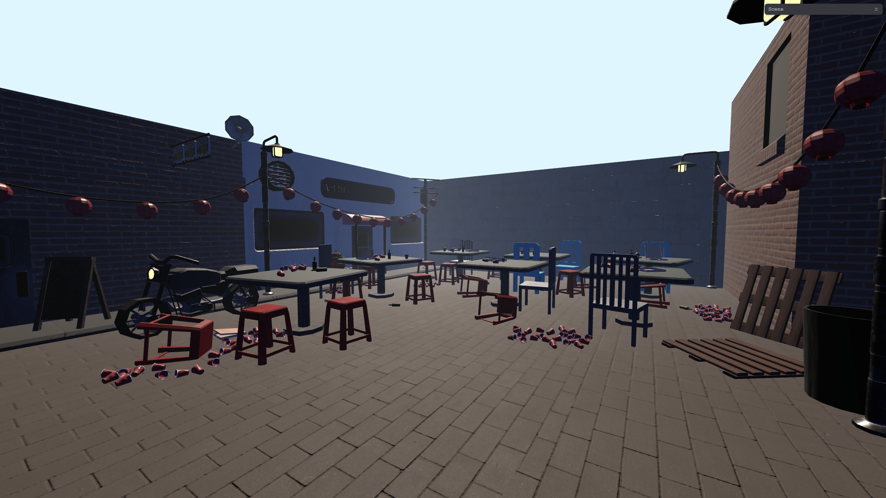
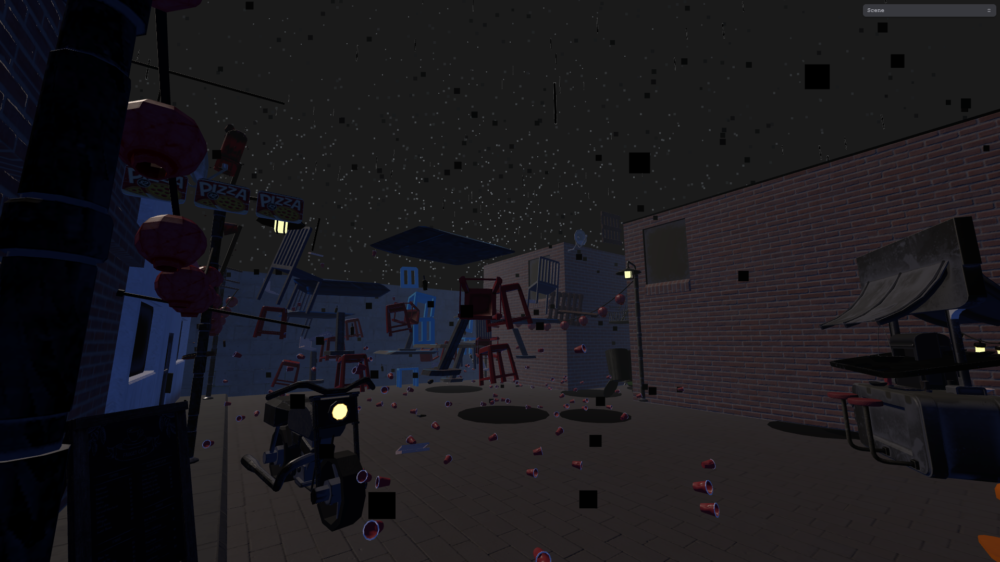

# The-Reverse-Storm
Let the Rain Raise

# Description
The-Reverse-Storm is a visualisation of an apocalyptic storm taken inspiration from the WNDR Museum's Inside Out and The Storm from the game Reverse1999.  Like the name of the project suggests, it is a recreation of a storm but has certain elements of "reversing" such as how the rain starts from the ground and flows upward.  The main visuals also include chaotic elements with floating objects and destruction.  The storm is demonstrated in a "scene" which lasts around 1min and 30secs and can then be reset. This will be indicated by the bright sky above.

# Usage
Upon loading the page up, the scene starts after 1 left mouse click.
After the first cycle ends and the terrain resets, the scene can be started up again by pressing "R". Note: This only works in sky-view (the default view you start with). When pressed ESC, all sounds and animations will be paused, so you can step away for an emergency and come back and enjoy the scene as needed. Other controls include the scene UI which can adjust light, ambient light, fog and light intensity which can also be accessed when you pressed ESC. In sky-view, pressing "Q" will toggle on-click destruction.  Pressing "W" will toggle object select, combined with the "E" rotation toggle will highlight and rotate objects once clicked. In first-person-view, WASD + mouse will control your movement and view control. SPACE can help you jump if needed. There is no wall collison installed so you can walk around at your own immersion. C will toggle between these 2 camera view.

# Future Improvements
We are still considering the best way to consider using object munipulation to demonstrate the scene so the objects can
move the way we want to exactly.  For example we want to improve the movement of the cups to flow more upwards and in a circular
movemenet while still containing wobbling.  Some other improvements would be adding a background that fits and creating a more
dynamic scene with lightsource that comes from the lamps. There are plans to add a secret boss fight in reference to Infinite Regressor's Monsoon anomaly. There are also plans to add shadering and multiple/bigger scenes.  

# Common problems and solutions
Since the 3D model was imported from an outside source, there are some difficulties with munipulating the objects. The
current solution to this was to use to find the names or commonalities of the object groups through selection to
munipulate each object. Also originally we were all working in the html file but ran into constant conflicts during the github merging, to fix this, we decided to make seperate js files that contribute to seperate parts.

Q: Is there a limit to how far I can go with first-person-view?
A: No.

Q: Why does it take so long to load?
A: There are over 600 objects and over 80% will be manipulated in a way. 

# Authors and acknowledgment
Thanks to:
Brian Ngan for finding and importing the model, object munipulation, object movement and destruction, etc.
Kam Lun Cheung for adding the effects, rain, puddle, fog, etc, camera set up, video editing.

Help from ChatGPT, copilot, Olivier Larose for floating effect, and Nazareno_rojas for the 3D model.
https://sketchfab.com/3d-models/urban-enviroment-2e5cb092ff2948bc9c500b73aa5c7829.

# Images
Day Time:

Night Time:

# Teaser

